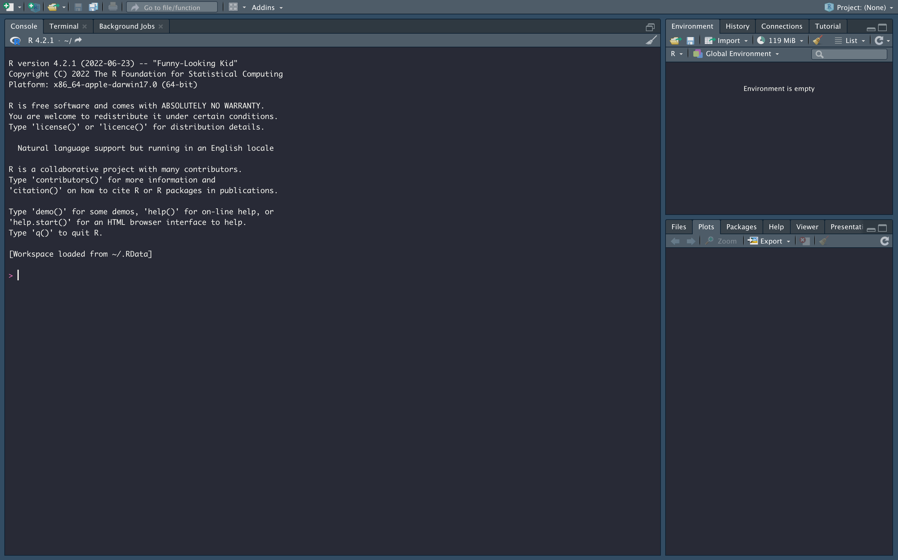
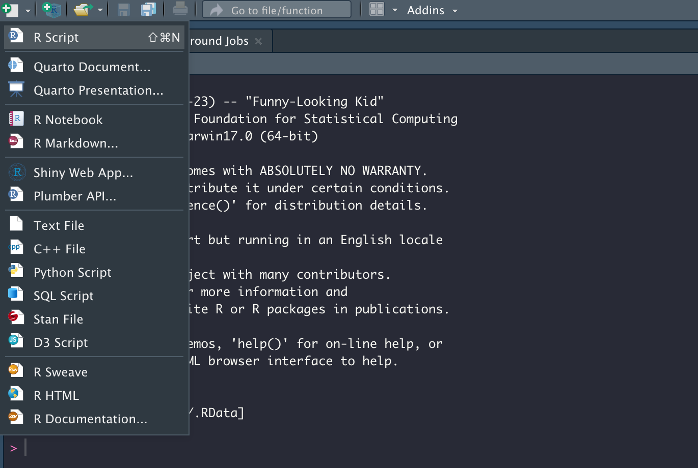
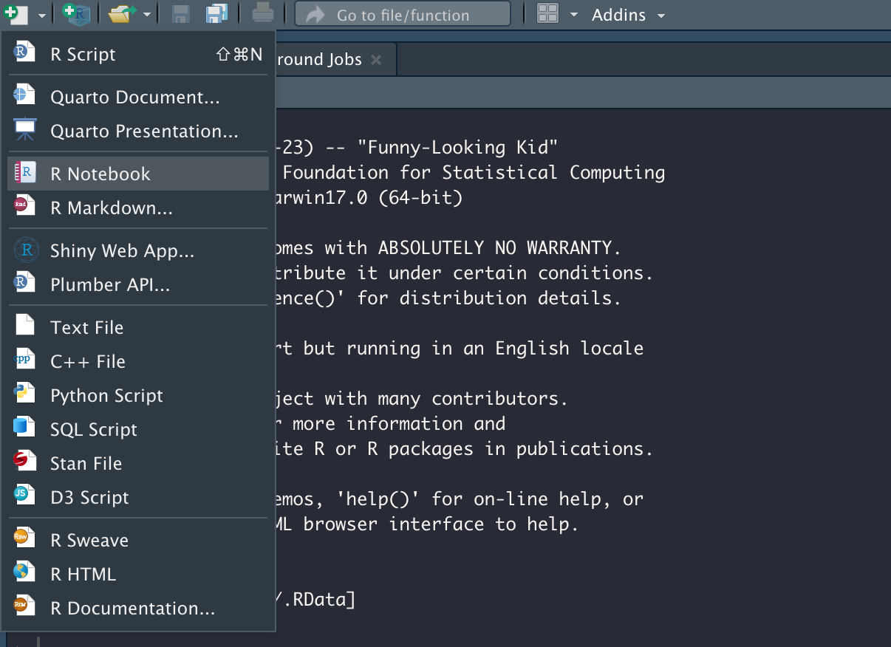
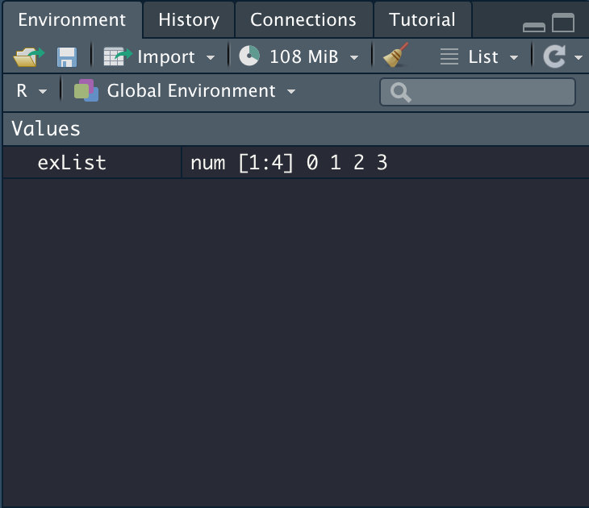

```{r setup, include=FALSE}
knitr::opts_chunk$set(echo = TRUE)
```

# Introduction

This post is a part of a series about `mlr3`, see the other posts:

-   Create your first R Project (this post)

-   Learn the right way to train simple models: [link](https://nfoss2.github.io/mlr3_models_post)

-   learn how to impute missing values with mlr3 pipelines: [link](https://nfoss2.github.io/mlr3_imputation_post)

This blog post will introduce you to `mlr3` and give an example of how to setup your `mlr3` project. After following this blog post you should be able to run the quick-start example from the `mlr3` [book](https://mlr3book.mlr-org.com/).

## Helpful Links

-   Comprehensive R Setup: [link](https://bookdown.org/yih_huynh/Guide-to-R-Book/what-to-download.html) (Our favorite)

-   R CRAN page: [link](https://cran.r-project.org/)

-   Rstudio: [link](https://www.rstudio.com/products/rstudio/download/)

## Download Requirements

-   You will need to have the proper R version for your machine downloaded. Look at the R CRAN [page](https://cran.r-project.org/) for details.
-   For this tutorial we will be using RStudio, so go ahead and download the appropriate version of that as well [here](https://www.rstudio.com/products/rstudio/download/).

## Open Your First R Script

**Step 1:** Open RSudio you should see a set up like this:



**Step 2:** Install `mlr3`

Do this by entering `install.packages("mlr3")` into the console tab.

Note: `install.packages()` only needs to be run once, `library()` however, needs to be run each time you open an R session.

**Step 3:** Open a new R script by selecting it from the drop down menu when you click the add button.



**Step 4:** Start writing code!

To ensure that `mlr3` has been downloaded properly and to load in the library type in the following code snippet into your R Script then run:

```{r}
library("mlr3")
```

Continue along with the rest of the quick-start from the [book](https://mlr3book.mlr-org.com/).

## Open Your First R Notebook

**Step 1:** Follow instructions from step 1 & 2 in the previous section

**Step 2:** Select R Notebook from the drop down menu when you click the add button.



**Step 3:** Insert chunk by following the instructions in new Notebook.

**Step 4:** Start writing code!

To ensure that `mlr3` has been downloaded properly and to load in the library type in the following code snippet into your code chunk you just created then run.

```{r}
library("mlr3")
```

Continue along with the rest of the quick-start from the [book](https://mlr3book.mlr-org.com/).

## Notes on RStudio

-   The Environment area of RStudio will show the variables in your current environment.

For example, if you created the variable `exList` like so:

```{r}
exList = c(0,1,2,3)
```

The Environment tab would look this this:

{width="301"}

-   You can clear your environment with the broom button: {width="22"}

-   You can bring in data sets in nearly any form by clicking: {width="33" height="20"}
